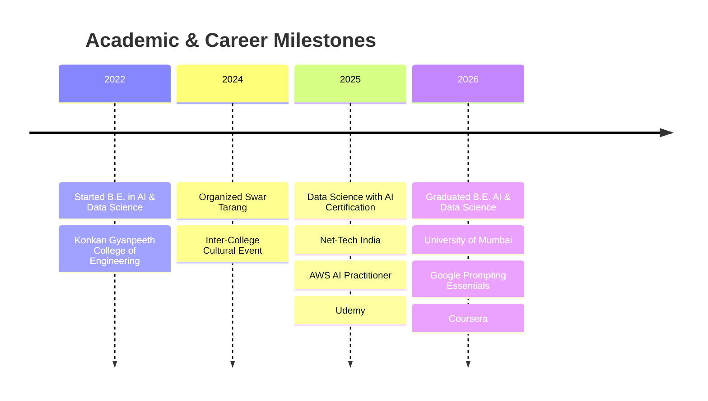

<div align="center">

# Hi 👋, I'm Samarth Kanade


<br/>

[](https://www.linkedin.com/in/samarth-kanade19/)
[](mailto:samarthkanade983@gmail.com)

<br/>


</div>

---

### 🧠 About Me

```yaml
name: Samarth Prashant Kanade
role: AI & Data Science Graduate
location: Badlapur, Maharashtra, India
education: B.E. Artificial Intelligence & Data Science, University of Mumbai (2022–2026)
interests: Machine Learning, Deep Learning, NLP, LLMs, Data Analytics
hobbies: Percussion 🥁 | Vocals 🎤 | Painting 🎨
currently_exploring: LLM-powered applications & real-world AI systems
```

- 🎓 Graduated **B.E. in Artificial Intelligence & Data Science** — University of Mumbai
- 💡 Passionate about solving real-world problems through data-driven technology
- 🔭 Currently exploring **Machine Learning, Deep Learning & LLM-powered applications**
- 🌱 Always learning — one dataset, one model, one project at a time
- ⚡ Fun fact: I keep rhythm both in code and on the drums 🥁

---

### 🎓 Journey So Far



---

### 🏅 Certifications

<div align="center">

| Certification | Provider |
|---|---|
| 🧬 Data Science with AI | Net-Tech India, Thane |
| ☁️ AWS AI Practitioner | Udemy |
| ✨ Google Prompting Essentials | Coursera |

</div>

---

### 🛠️ Tech Stack

<div align="center">


<br/><br/>


<br/>


<br/>


</div>

---

### 🚀 Featured Projects

<table align="center" width="100%">
<tr>
<td width="33%" valign="top">

**🩺 AI Medical Report Summarizer**

Hybrid pipeline (GMM, Naïve Bayes + Google Gemini API) delivering context-aware summaries of medical reports.

`Python` `Gemini API` `ML`

</td>
<td width="33%" valign="top">

**🔗 Link-Sniff**

Flask-based security tool that extracts and analyzes URLs from PDFs to detect phishing in real time.

`Flask` `Security` `PDF Parsing`

</td>
<td width="33%" valign="top">

**🏠 Real Estate Management Portal**

Role-based, secure dashboard for property listing, tenant communication & financial tracking.

`Full-Stack` `RDBMS` `Dashboard`

</td>
</tr>
</table>

---

### 📊 GitHub Stats

<div align="center">


</div>

---

### 📈 Contribution Chart

<div align="center">


</div>

---

### 🎯 Position of Responsibility

**Organizer — Swar Tarang** (Inter-College Cultural Event, 2024–2025)
Led planning, coordination, and execution of a large-scale cultural event.

---

### 🎨 Beyond Code

<div align="center">

🥁 Professional Musician (Percussion & Vocals) &nbsp;|&nbsp; 🎨 Drawing & Painting Enthusiast


</div>

---

<div align="center">

### 📫 Let's Connect

[](https://www.linkedin.com/in/samarth-kanade19/)
[](mailto:samarthkanade983@gmail.com)

<br/>

*"Turning data into decisions, one model at a time."*

</div>
